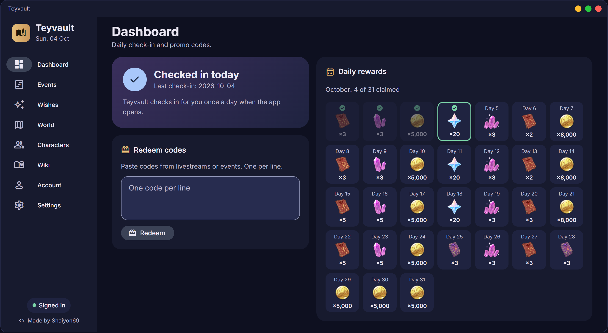
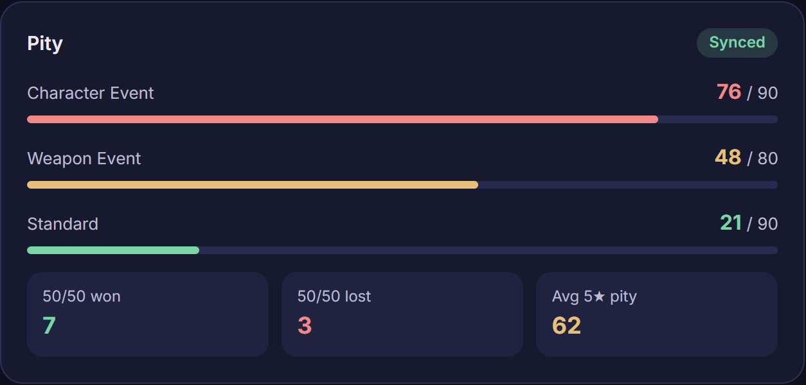
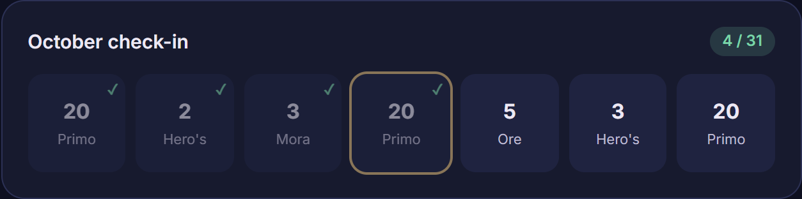
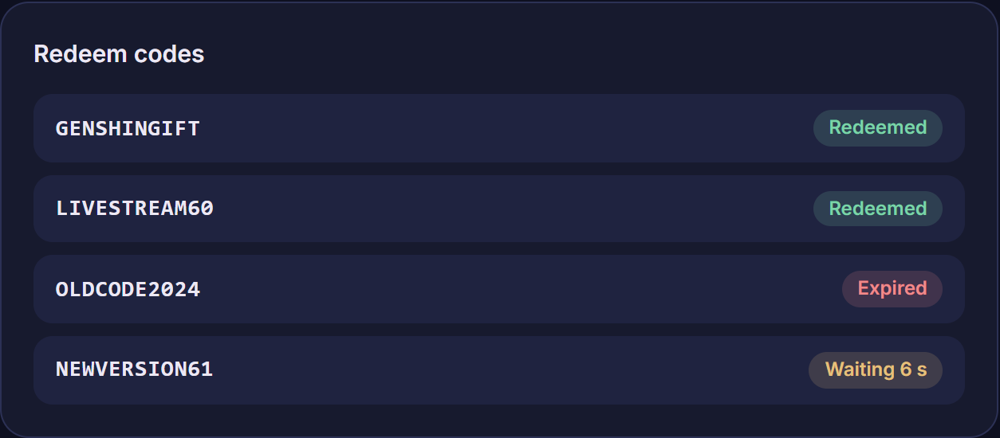
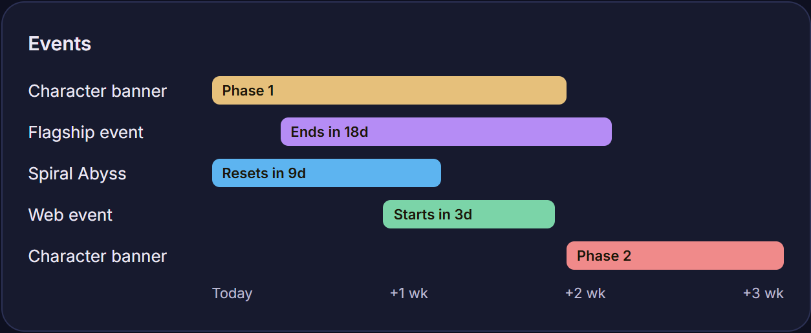
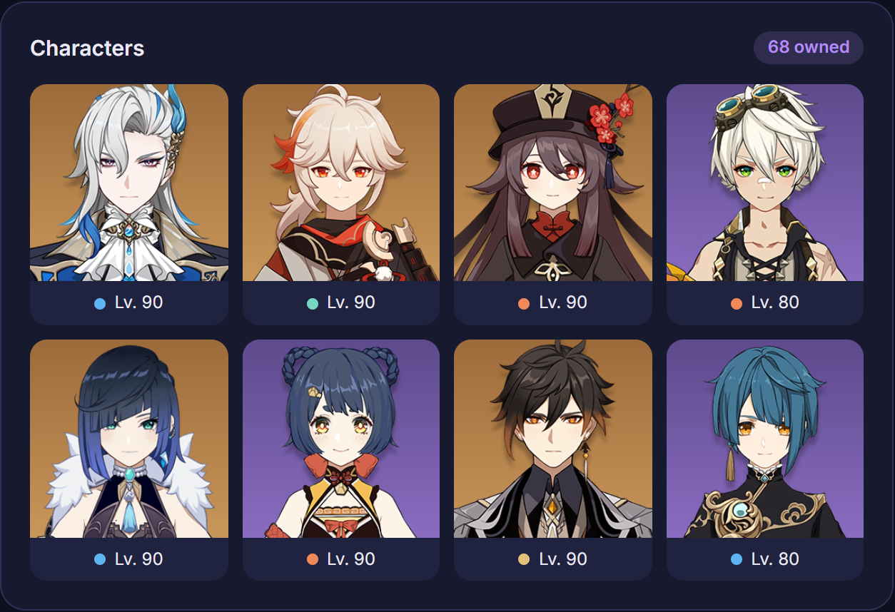
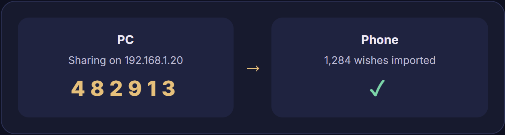

<div align="center">


# Teyvault

**Everything Teyvat, one vault.**

Teyvault claims your daily HoYoLAB check-in, redeems promo codes and tracks every wish with pity and 50/50 stats.
One app for PC and phone. Free and open source, no ads.

[**Download for Windows**](https://github.com/Shaiyon69/teyvault/releases/latest/download/Teyvault-Setup.exe) ·
[**Android APK**](https://github.com/Shaiyon69/teyvault/releases/latest/download/Teyvault.apk) ·
[Website](https://shaiyon69.github.io/teyvault/)

<sub>Windows 10/11 · Android · Global servers (America, Europe, Asia, TW/HK/MO)</sub>

<br>



</div>

## Features

<table>
<tr>
<td width="50%">

### Know exactly where your pity stands

Teyvault reads your wish link from the game's cache, pages your whole history and keeps it in a local database. It never touches the game itself.

- Pity for every banner, including the second character banner
- 50/50 record, guarantee status and average 5★ pity
- UIGF v2–v4 and Excel import/export, paimon.moe sheets too

</td>
<td width="50%">
<picture>
  <source media="(prefers-color-scheme: light)" srcset="docs/readme/wishes-light.png">
  
</picture>
</td>
</tr>
<tr>
<td>
<picture>
  <source media="(prefers-color-scheme: light)" srcset="docs/readme/checkin-light.png">
  
</picture>
</td>
<td>

### Never miss a login reward

Sign in once and Teyvault claims your HoYoLAB daily reward when it opens, with the month's calendar and the real reward icons.

- Automatic check-in, which you can turn off in Settings
- One claim a day, never more

</td>
</tr>
<tr>
<td>

### Redeem codes without the game

Paste one code or a whole livestream's worth. Teyvault redeems them to your account one at a time, spaced out the way the official page requires.

</td>
<td>
<picture>
  <source media="(prefers-color-scheme: light)" srcset="docs/readme/codes-light.png">
  
</picture>
</td>
</tr>
<tr>
<td>
<picture>
  <source media="(prefers-color-scheme: light)" srcset="docs/readme/events-light.png">
  
</picture>
</td>
<td>

### See what's running, and what's next

A timeline of current and upcoming events in your server's time, plus the banners that are live right now with their featured 5★ and 4★ and time left.

</td>
</tr>
<tr>
<td>

### Your account at a glance

Builds, exploration progress and an in-app wiki, with Prydwen tier ratings to sort by.

- Weapons, artifacts (with Crit Value) and talents for every character
- Exploration and reputation for every region
- Wiki of characters, weapons, artifacts, enemies, namecards, wings, outfits and achievements, readable offline
- Full or Lite talent descriptions
- Tick off achievements as you go

</td>
<td>
<picture>
  <source media="(prefers-color-scheme: light)" srcset="docs/readme/characters-light.png">
  
</picture>
</td>
</tr>
<tr>
<td>
<picture>
  <source media="(prefers-color-scheme: light)" srcset="docs/readme/sync-light.png">
  
</picture>
</td>
<td>

### Take your history with you

The game's wish link lives on your PC. Share your history from the PC app and pull it onto your phone over Wi-Fi with a one-time PIN. Only wishes are sent, never your login.

</td>
</tr>
</table>

Four looks to pick from in Settings: Classic, Material You, Glass and Nothing, each in light or dark.

## Your account stays yours

Teyvault only does what the official HoYoLAB pages do, at the same pace.

| | |
|---|---|
| **Login in your OS keyring** | Your HoYoLAB cookies go in Windows Credential Manager, or the app's private storage on mobile. Never in the database, never sent anywhere but HoYoLAB. |
| **Official endpoints only** | Only the requests hoyolab.com and the in-game wish page make. No reading game memory, no injection. |
| **Polite by design** | Requests go one at a time and spaced out. One check-in a day, with a cooldown between codes. |
| **Local first** | Your wish history stays in a database on your device. No account, no server, no tracking. |

## Install

Download from the [latest release](https://github.com/Shaiyon69/teyvault/releases/latest):

- **Windows**: `Teyvault-Setup.exe`. Run it and click through; no admin rights needed. Windows SmartScreen may warn because the installer isn't code-signed: click *More info* then *Run anyway*.
- **Android**: `Teyvault.apk`. Open it on your phone and allow installing from your browser when asked.

Your wish history and sign-in are kept when you update or reinstall. Wish history works without signing in; HoYoLAB sign-in unlocks check-in, codes and your account stats.

## Questions

<details>
<summary><b>Can this get my account banned?</b></summary>

Teyvault never touches the game client. It only reads the wish link the game already caches, and calls the same HoYoLAB endpoints your browser does, spaced out like a person would.
</details>

<details>
<summary><b>Which servers does it support?</b></summary>

All global servers: America, Europe, Asia and TW/HK/MO. Chinese mainland servers use a different platform and aren't supported.
</details>

<details>
<summary><b>How do I get my wish history on Android?</b></summary>

Open the wish history in-game on your PC, sync in the Windows app, then use Phone sync (Settings on both). Or import a UIGF or paimon.moe Excel export on the phone.
</details>

<details>
<summary><b>Can I bring my history from paimon.moe or other trackers?</b></summary>

Yes. Teyvault imports UIGF v2–v4 files and paimon.moe Excel exports, and replaces imported rows with the real ones once you sync.
</details>

<details>
<summary><b>Why does sign-in ask for a captcha?</b></summary>

HoYoLAB asks for a Geetest check on most sign-ins. Teyvault shows the same check the website does.
</details>

## Run from source

Python 3.11+ on any OS.

```sh
pip install -e .
teyvault-gui        # desktop app
teyvault wish stats # CLI
python -m unittest discover -s tests
```

Package mobile with `flet build apk | ipa`. Pushing a `v*` tag builds the Windows installer and APK and publishes them as a GitHub Release (`.github/workflows/release.yml`).

---

<div align="center"><sub>Made by <a href="https://github.com/Shaiyon69">Shaiyon69</a>. Not affiliated with HoYoverse.</sub></div>
